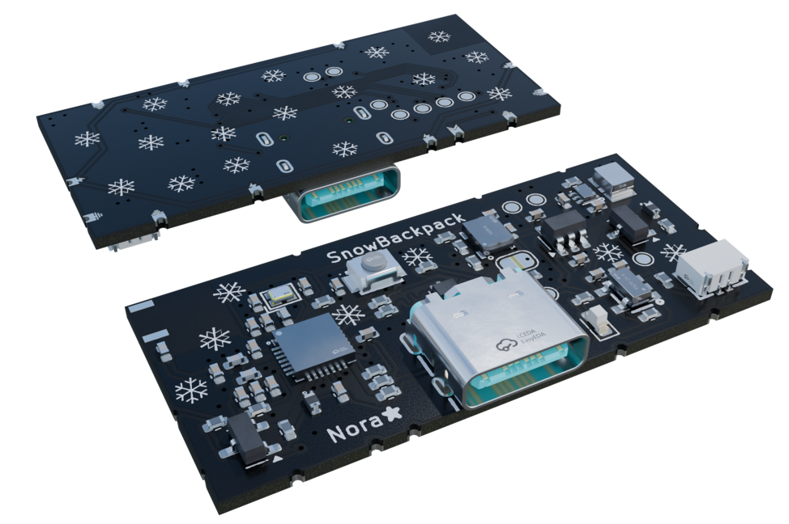

# SnowBackpack
Cute ESP32-C3 backpack for a 2 x n [SnowPixel](https://github.com/wandering-nora/SnowPixel) matrix display.

This board can power a grid of 2+ SnowPixel displays without any wiring in a thin package.

The main features are:
- ESP8685H4 mcu with 4MB of flash, Wifi and BLE
- Battery charging for protected 1s lipo cells
- ST LSM6DSO 6-axis low power accelerometer
- Efficient 5V boost converter with 500mA max current for the SnowPixel modules
- On board ceramic antenna

## Todo for V1.2
- [ ] Get rid of jumper on data out pad
- [ ] Change battery connector to a 1A capable one
- [ ] Consider removing extra pads on long edge

